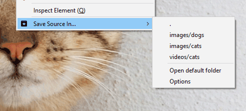

# save-in

[Firefox Addons](https://addons.mozilla.org/en-US/firefox/addon/save-in) 
[Chrome Web Store](https://chrome.google.com/webstore/detail/save-in%E2%80%A6/jpblofcpgfjikaapfedldfeilmpgkedf) 
[Releases](https://github.com/gyng/save-in/releases/)

A web extension for Firefox and Chrome.

Adds a context menu to save media {image, video, audio, link, selection, page} in user-defined folders or directories relative to the default download location.

Save into dynamically named directories.

Flexible rules-based download renaming and routing.

Option to save as shortcuts {.url, .desktop, .html redirect}.

The WebExtension API only allows saving into directories relative to the default download directory. Symlinks can be used to get around this limitation:

Linux/Mac:

    ln -s /path/to/actual /default_download_dir/symlink

Windows:

    mklink /d \default_download_dir\symlink \path\to\actual

Make sure the actual directories exist, or downloads will silently fail.

* <all_urls> permission is used to get around CORS on HTTP HEAD requests (to check for Content-Disposition headers)
* tabs permission is used to get the active page's title.
* webRequest permissions are required to inject the Referer header on downloads (disabled by default)

Configure before use.

## Development

1. Install dev dependencies `yarn install`
2. `yarn d` to start a dev Firefox instance using web-ext
3. Develop
4. `yarn prettier` and/or `yarn prettier:write`
5. `yarn lint` and/or `yarn lint:fix`
6. `yarn test` and/or `yarn test:watch`

## Deployment

### ZIP file

1. `yarn build` to create a zip in `web-ext-artifacts` directory

### Firefox

1. Get API keys from [here](https://addons.mozilla.org/en-US/developers/addon/api/key/)
2. Set environment variables `WEB_EXT_API_KEY` (JWT issuer) and `WEB_EXT_API_SECRET`
3. `yarn build:firefox:submit` to sign and upload to AMO (Firefox Addons), or manually upload at [Firefox Addons](https://addons.mozilla.org/en-US/developers/addons)
4. `yarn build:firefox:submit` also generates an XPI for manual distribution
5. Add https://github.com/yuku-t/textcomplete/releases in the comments when uploading.

### Chrome

1. Go [here](https://chrome.google.com/webstore/developer/dashboard)
2. Upload built ZIP file

### Notes for reviewers

#### Third-party dependencies

##### Textcomplete

The archive containing this library can be downloaded from https://github.com/yuku-t/textcomplete/releases/download/v0.17.1/textcomplete-0.17.1.tgz

The vendored source for the minified Textcomplete library is obtained from within the archive located at  `package/dist/textcomplete.min.js`

This link to the archive was retrieved from https://github.com/yuku-t/textcomplete/releases. The minified source is included with the source of this addon in `src/options/vendor/textcomplete/textcomplete.min.js`

`yarn install` installs the dependencies for the library
`yarn build:dist` builds the distribution for the library

## Contributors

Bug reports and issues are welcome.

Localisations kindly contributed by

* nl [@80486dx](https://github.com/80486dx)
* sv [@Sopor-](https://github.com/Sopor-)
