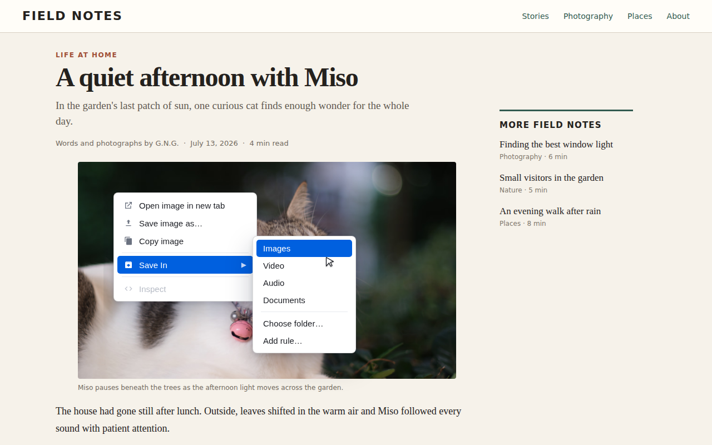

# Save In

[Firefox Add-ons](https://addons.mozilla.org/en-US/firefox/addon/save-in) 
[Chrome Web Store](https://chromewebstore.google.com/detail/save-in/jpblofcpgfjikaapfedldfeilmpgkedf) 
[Releases](https://github.com/gyng/save-in/releases/)

[Privacy policy](PRIVACY.md) · [Manual install](#manual-install)

A WebExtension for Firefox and Chrome that adds a context menu for saving images,
video, audio, links, selected text, and pages into user-defined folders inside
the default download location.

- Save into dynamically named directories.
- Rename and route downloads with flexible routing rules.
- Exclude matching saves or close their source tab after a routed save starts.
- Create shortcut files as Windows internet shortcuts (`.url`), macOS internet
  locations (`.webloc`), Linux desktop shortcuts (`.desktop`), or HTML
  redirects (`.html`).
- Browse sortable, filterable download history, manage active or completed
  downloads, replay a row in the Route debugger, copy saved paths or source
  URLs, and export all stored fields as JSON or formula-safe CSV/TSV.
- Select and batch-save filtered Page Sources, or draft a guarded automatic
  rule directly from a discovered source.
- Keep quick access to recent destinations, make individual destinations open
  Save As, and optionally save a source-link shortcut beside downloaded media.
- Build paths from dates, page and source parts, `:counter:`, `:uuid:`,
  `:mime:`, `:mimeext:`, and other variables. Open **Reference** in Options for
  the maintained variable and matcher list. Use `:pagerootdomain:` or
  `:sourcerootdomain:` when the folder should omit subdomains such as `www` or
  numbered CDN hosts (#221).
- Match normalized MIME types (`mime:` / `contenttype:`), referrer URLs and
  hostnames, page or source root domains, and the browser-resolved
  `finalfilename:` in routing rules. Use `:menupath:` in a destination to
  include the folder chosen from the Save In menu.
- Route interactive link saves with the clicked link's explicit
  `:linktitle:` or `:linkdownload:` metadata without changing existing
  `:linktext:` rules.
- Inspect MV3 background health, lifecycle events, configuration issue counts,
  and recent session failures from the collapsed Diagnostics panel in Advanced.

See [Destination and source workflows](docs/using/DESTINATION-AND-SOURCE-WORKFLOWS.md)
for destination-specific Save As behavior, recent locations, Page Sources
batches, History actions, and source-link sidecars.

Page Sources can automatically save newly discovered matching media. Automatic
saves are off by default and use guarded routing rules with an
explicit `context: ^auto$`, a page condition, and a source condition. Rules can
be created from a Page Sources row or in **Visual** mode under **Routing rules**
and remain subject to
private-window and per-page safety limits. See
[Automatic source saves](docs/using/AUTOMATIC-SOURCE-SAVES.md).

Optionally include matching ordinary browser downloads in local history. Chrome
can apply routing rules before saving; Firefox offers a separately
labelled experimental cancel-and-redownload mode for matching HTTP(S) downloads.

A versioned external API plus configuration tools support scripts and compatible
in-browser AI agents through WebMCP. See the source-controlled
[integration contract](docs/integrating/INTEGRATIONS.md).

Version 4 is a [Manifest V3](https://github.com/gyng/save-in/wiki/Manifest-V3) extension on Firefox 140+ and Chrome 123+.

The WebExtension API only allows saving into directories relative to the default
download directory. Firefox can follow a symlink placed there to another
existing directory. Current Chrome versions reject symlinked download
destinations, so this workaround is Firefox-only.

Linux/macOS:

    ln -s /path/to/actual /default_download_dir/symlink

Windows:

    mklink /d \default_download_dir\symlink \path\to\actual

Make sure the target directory exists. Firefox reports a failed download when
the target is missing or inaccessible.

- `<all_urls>` is used for page features and extension-context HEAD/fetch requests.
- The optional Referer filter supports anti-hotlink downloads. Both browsers use
  a temporary, exact declarativeNetRequest rule around requested metadata or
  content fetches, so protected downloads can use MIME, final-URL, and SHA-256
  variables. Firefox keeps its native `downloads.download({ headers })` final
  transfer unless content was already fetched for hashing; Chrome saves the
  protected content blob. Save In does not request `webRequest` or
  `webRequestBlocking`.
- Extension-side Fetch/HEAD requests include applicable credentials by default,
  including at redirect destinations. They can be made anonymous in Advanced
  downloading and require no cookie-reading permission. Private-window
  extension requests are always anonymous because the shared background cannot
  select a private cookie store, so authenticated resources that require Fetch
  mode may fail there. Firefox direct downloads use the private session.

## Manual install

Install from [Firefox Add-ons](https://addons.mozilla.org/en-US/firefox/addon/save-in)
or the [Chrome Web Store](https://chromewebstore.google.com/detail/save-in/jpblofcpgfjikaapfedldfeilmpgkedf)
if you can. Only the stores can ship an extension the browsers will install
permanently, keep updated, and trust by default. Each
[release](https://github.com/gyng/save-in/releases/) also attaches the exact
package it sent to the stores, for testing a build before it is reviewed or
running one the stores never carried.

`save-in-X.Y.Z.zip` and `save-in-X.Y.Z.xpi` are the same bytes under two names,
and `save-in-X.Y.Z-chromium.crx` is that ZIP behind a signature header.
`SHA256SUMS` covers all three.

**Chromium-based browsers** (Chromium, ungoogled-chromium, Brave, Vivaldi) —
open `chrome://extensions`, turn on **Developer mode**, and drag
`save-in-X.Y.Z-chromium.crx` onto the page.

**Google Chrome** installs extensions only from the Web Store, and no file
changes that. Use the Web Store link above, or unzip `save-in-X.Y.Z.zip` and
choose **Load unpacked** on the folder with **Developer mode** on. Keep the
folder where it is: an unpacked extension's ID is derived from its path, so
moving it makes Chrome treat it as a new extension and its settings disappear.

**Firefox** — open `about:debugging#/runtime/this-firefox`, choose **Load
Temporary Add-on**, and pick `save-in-X.Y.Z.xpi`. It is removed when Firefox
closes. Installing it permanently needs a signed package, so it works only on
Developer Edition, Nightly, or ESR with `xpinstall.signatures.required` set to
`false` in `about:config`; release and beta Firefox refuse the file.

### Sideloaded builds have their own extension ID

An extension's ID comes from whoever signed it, and only the stores can sign as
the store. So a sideloaded Save In is a **separate extension** from the store
one: install both and you get two, each with its own settings, history, and
rules. Nothing transfers between them, and uninstalling one leaves the other.

This matters if another extension talks to Save In. Integration recipes address
the store build, so on a sideloaded build point them at the ID shown at the top
of Save In's own Options page instead of the published one.

| Install                   | Extension ID                                                                            |
| ------------------------- | --------------------------------------------------------------------------------------- |
| Firefox, any of the above | `{72d92df5-2aa0-4b06-b807-aa21767545cd}` — declared in the manifest, so it never varies |
| Chrome Web Store          | `jpblofcpgfjikaapfedldfeilmpgkedf`                                                      |
| `-chromium.crx`           | Fixed, and the same for everyone. Shown in Options.                                     |
| Load unpacked             | Derived from the folder path, so it differs on every machine                            |

## Integrations

Save In exposes a versioned external API to other extensions. `PING`,
`GET_SCHEMA`, `GET_KEYWORDS`, `GET_GRAMMARS`, and `VALIDATE` are open for
discovery and validation; `DOWNLOAD` additionally requires an explicitly
approved extension ID. `GET_CONFIG` and `APPLY_CONFIG` are same-extension only.
Experimental WebMCP tools serve compatible in-browser agents. See the
source-controlled [integration contract](docs/integrating/INTEGRATIONS.md) for the protocol,
availability, and trust model.

## Notes for reviewers

### Source code

The source code for this extension is available at https://github.com/gyng/save-in.

### Third-party dependencies

All shipped extension code is first-party except
`src/vendor/content-disposition.ts`, a
readable (non-minified) Content-Disposition header parser by @Rob--W, taken
from https://github.com/Rob--W/open-in-browser (license header in the file).
There are no minified files or remote code. Rolldown transpiles and
scope-hoists the TypeScript modules into one readable, non-minified JavaScript
file per execution target; the shipped bundle remains suitable for review.

## Contributors

Pull requests, bug reports, and issues are welcome.
See the [contributor guide](AGENTS.md) for development setup and validation, and
the [release workflow](docs/release/workflow.md) for packaging and store submissions.
[docs/](docs/README.md) indexes the rest, including the UI, integration, and
security review contracts.
