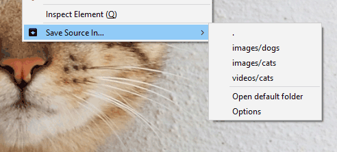

# save-in

[Firefox Addons](https://addons.mozilla.org/en-US/firefox/addon/save-in)<br />
[Chrome Web Store](https://chrome.google.com/webstore/detail/save-in%E2%80%A6/jpblofcpgfjikaapfedldfeilmpgkedf)<br />
[Releases](https://github.com/gyng/save-in/releases/)

[Privacy policy](PRIVACY.md)



A web extension for Firefox and Chrome.

Adds a context menu to save media {image, video, audio, link, selection, page} in user-defined folders or directories relative to the default download location.

Save into dynamically named directories.

Flexible rules-based download renaming and routing.

Option to save as shortcuts {.url, .desktop, .html redirect}.

Records a sortable, filterable download History with JSON and formula-safe CSV/TSV exports.

Rich path variables — dates, page/source parts, `:counter:`, `:uuid:`, and `:mime:`/`:mimeext:` (from the file's Content-Type). See the [wiki](https://github.com/gyng/save-in/wiki/Clause-and-Variable-list).

Optionally include matching ordinary browser downloads in local history. Chrome
can apply Dynamic Downloads rules before saving; Firefox offers a separately
labelled experimental cancel-and-redownload mode for matching HTTP(S) downloads.

A versioned external API plus config tools for scripts and AI agents (WebMCP). See [Integrations](https://github.com/gyng/save-in/wiki/Integrations).

Version 4 is a [Manifest V3](https://github.com/gyng/save-in/wiki/Manifest-V3) extension on Firefox 121+ and Chrome 123+.

The WebExtension API only allows saving into directories relative to the default download directory. Symlinks can be used to get around this limitation:

Linux/Mac:

    ln -s /path/to/actual /default_download_dir/symlink

Windows:

    mklink /d \default_download_dir\symlink \path\to\actual

Make sure the actual directories exist, or downloads will silently fail.

- `<all_urls>` is used for page features and extension-context HEAD/fetch requests.
- Firefox can set a Referer through `downloads.download({ headers })`; Chrome does not support this option. Save In does not request `webRequest` or declarativeNetRequest.
- Extension-side Fetch/HEAD requests include applicable credentials by default,
  including at redirect destinations. They can be made anonymous in Advanced
  downloading and require no cookie-reading permission. Private-window
  extension requests are always anonymous because the shared background cannot
  select a private cookie store, so authenticated resources that require Fetch
  mode may fail there. Firefox direct downloads use the private session.

Configure before use.

## Integrations

Save-in exposes a versioned external API (`PING` + `DOWNLOAD`), a config API
(`GET_SCHEMA` / `VALIDATE` / `APPLY_CONFIG`), and experimental WebMCP tools for
AI agents. Full docs, a Foxy Gestures example, and the trust model are on the
[Integrations wiki](https://github.com/gyng/save-in/wiki/Integrations).
External download requests are denied until the caller's extension ID is added
to Advanced → External integrations. A blocked request shows a notification and
appears there with an Approve button. Trusted IDs can also be added with Allow
or removed individually; Save In records the caller, not its rejected URL.

Ready-to-use recipes: [Foxy Gestures](https://github.com/gyng/save-in/wiki/Integrations#foxy-gestures), [Gesturefy](https://github.com/gyng/save-in/wiki/Integrations#gesturefy), and [Tridactyl](https://github.com/gyng/save-in/wiki/Integrations#tridactyl). Extension developers should start with the [integration guide](https://github.com/gyng/save-in/wiki/Extension-integration-guide).

Minimal example — another extension triggers a routed download:

```js
// Choose the ID for the browser running the calling extension.
const SAVE_IN_ID = "jpblofcpgfjikaapfedldfeilmpgkedf"; // Chrome
// const SAVE_IN_ID = "{72d92df5-2aa0-4b06-b807-aa21767545cd}"; // Firefox

browser.runtime.sendMessage(SAVE_IN_ID, {
  type: "DOWNLOAD",
  body: {
    url: sourceUrl,
    // `comment` can be used for targeting in routing rules
    info: { pageUrl: `${window.location}`, srcUrl: sourceUrl, comment: "foo" },
  },
});
// -> { type: "DOWNLOAD", body: { status: "OK", version: 1, url } }
```

The download is routed through the same rename/routing rules as a context menu
save. `PING` first to negotiate the version and capabilities.

## Development

1. Install dev dependencies `npm install` (Node 24+)
2. `npm run d` to start a dev Firefox instance using web-ext, or `npm run d:chrome` for a Chrome dev loop with auto-reload
3. Develop
4. `npm run fmt:check` and/or `npm run fmt`
5. `npm run lint` and/or `npm run lint:fix`
6. `npm test` and/or `npm run test:watch`; `npm run e2e` runs Chrome and Firefox in parallel (`e2e:chrome` / `e2e:firefox` remain available separately). Browser failures retain diagnostics in `dist/e2e-artifacts`.

## Deployment

### ZIP file

1. `npm run build` creates the shared Manifest V3 ZIP in
   `web-ext-artifacts`; upload the same ZIP to both stores.

The manifest declares both background models and uses the cross-browser
`spanning` private-browsing mode. Save In excludes private activity from its
own history and debug log. Chrome cannot assign extension-started downloads to
its Incognito download context, so those downloads may appear in Chrome's
regular download manager; see `PRIVACY.md`. To load the extension unpacked in
Chrome, run `node scripts/build-bundled.js` and load `dist/bundled-pkg` (or use
`npm run d:chrome` for automatic rebuilds and reloads).

### Firefox

1. Run `npm run build`.
2. Manually upload the generated ZIP from `web-ext-artifacts` at
   [Firefox Add-ons](https://addons.mozilla.org/en-US/developers/addons).
3. Run `npm run build:source` and attach the resulting source ZIP from
   `web-ext-artifacts/source` when AMO requests the source for review.

The source build requires Node 24 and the dependencies pinned by
`package-lock.json`; no Docker image or nonstandard system dependency is
required. After extracting the source ZIP, run `npm ci` followed by
`npm run build`. The reproduced runtime ZIP is written to
`web-ext-artifacts`.

### Chrome

1. `npm run build`
2. Go [here](https://chrome.google.com/webstore/developer/dashboard)
3. Upload the ZIP from `web-ext-artifacts`

### Notes for reviewers

#### Source code

The source code for this extension is available at https://github.com/gyng/save-in.

#### Third-party dependencies

All code is first-party except `src/vendor/content-disposition.ts`, a
readable (non-minified) Content-Disposition header parser by @Rob--W, taken
from https://github.com/Rob--W/open-in-browser (license header in the file).
There are no minified files or remote code. Rolldown transpiles and
scope-hoists the TypeScript modules into one readable, non-minified JavaScript
file per execution target; the shipped bundle remains suitable for review.

## Contributors

Pull requests, bug reports, and issues are welcome.

Translation contributors are documented in [docs/CONTRIBUTORS.md](docs/CONTRIBUTORS.md).
