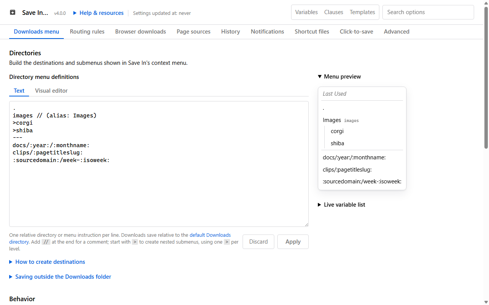

# save-in

[Firefox Addons](https://addons.mozilla.org/en-US/firefox/addon/save-in) 
[Chrome Web Store](https://chromewebstore.google.com/detail/save-in/jpblofcpgfjikaapfedldfeilmpgkedf) 
[Releases](https://github.com/gyng/save-in/releases/)

[Privacy policy](PRIVACY.md)

A web extension for Firefox and Chrome.

Adds a context menu to save media {image, video, audio, link, selection, page} in user-defined folders or directories relative to the default download location.

Save into dynamically named directories.

Flexible rules-based download renaming and routing.

Option to save as shortcuts {.url, .desktop, .html redirect}.

Records a sortable, filterable download History with JSON and formula-safe CSV/TSV exports.

Rich path variables — dates, page/source parts, `:counter:`, `:uuid:`, and `:mime:`/`:mimeext:` (from the file's Content-Type). See the [wiki](https://github.com/gyng/save-in/wiki/Clause-and-Variable-list).

Dynamic Downloads rules can match normalized MIME types (`mime:` / `contenttype:`), referrer URLs and hostnames, and page or source root domains.

Page Sources can automatically save newly discovered matching media. Automatic
saves are off by default and use guarded Dynamic Downloads rules with an
explicit `context: ^auto$`, a page condition, and a source condition. Rules are
created in the shared Visual routing editor and remain subject to private-window
and per-page safety limits. See [Automatic source saves](docs/AUTOMATIC-SOURCE-SAVES.md).

Optionally include matching ordinary browser downloads in local history. Chrome
can apply Dynamic Downloads rules before saving; Firefox offers a separately
labelled experimental cancel-and-redownload mode for matching HTTP(S) downloads.

A versioned external API plus config tools for scripts and AI agents (WebMCP). See [Integrations](https://github.com/gyng/save-in/wiki/Integrations).

Version 4 is a [Manifest V3](https://github.com/gyng/save-in/wiki/Manifest-V3) extension on Firefox 121+ and Chrome 123+.

The WebExtension API only allows saving into directories relative to the default download directory. Symlinks can be used to get around this limitation:

Linux/Mac:

    ln -s /path/to/actual /default_download_dir/symlink

Windows:

    mklink /d \default_download_dir\symlink \path\to\actual

Make sure the actual directories exist, or downloads will silently fail.

- `<all_urls>` is used for page features and extension-context HEAD/fetch requests.
- The optional Referer filter supports anti-hotlink downloads. Both browsers use
  a temporary, exact declarativeNetRequest rule around requested metadata or
  content fetches, so protected downloads can use MIME, final-URL, and SHA-256
  variables. Firefox keeps its native `downloads.download({ headers })` final
  transfer unless content was already fetched for hashing; Chrome saves the
  protected content blob. Save In does not request `webRequest` or
  `webRequestBlocking`.
- Extension-side Fetch/HEAD requests include applicable credentials by default,
  including at redirect destinations. They can be made anonymous in Advanced
  downloading and require no cookie-reading permission. Private-window
  extension requests are always anonymous because the shared background cannot
  select a private cookie store, so authenticated resources that require Fetch
  mode may fail there. Firefox direct downloads use the private session.

## Integrations

Save-in exposes a versioned external API (`PING` + `DOWNLOAD`), a config API
(`GET_SCHEMA` / `VALIDATE` / `APPLY_CONFIG`), and experimental WebMCP tools for
AI agents. See the source-controlled [integration contract](docs/INTEGRATIONS.md)
for the protocol and trust model, or the
[Integrations wiki](https://github.com/gyng/save-in/wiki/Integrations) for
ready-to-use recipes.

## Development

1. Install dev dependencies `npm install` (Node 24+)
2. `npm run d` to start a dev Firefox instance using web-ext, or `npm run d:chrome` for a Chrome dev loop with auto-reload
3. Develop
4. `npm run fmt:check` and/or `npm run fmt`
5. `npm run lint` and/or `npm run lint:fix`
6. `npm test` and/or `npm run test:watch`; `npm run test:integration` adds tests that require loopback listeners or child processes, and `npm run test:all` runs both suites. `npm run test:fuzz` runs a ten-second property fuzz of the parser, routing, filename, and webhook boundaries; see the [fuzzing guide](docs/FUZZING.md). Set a longer budget with `node scripts/with-env.js FUZZ_TIME_MS=60000 -- npm run test:fuzz`; failures print a replayable property and seed, plus a shrink path when available.
7. `npm run e2e` runs Chrome and Firefox in parallel (`e2e:chrome` / `e2e:firefox` remain available separately). Browser failures retain diagnostics in `dist/e2e-artifacts`.

## Deployment

`npm run build` creates the shared Manifest V3 ZIP in `web-ext-artifacts` for
both stores. AMO also requires the reproducible source ZIP created by
`npm run build:source`. See the [release workflow](docs/RELEASE.md) for release
gates, upload guidance, permission rationales, and manual checks.

### Notes for reviewers

#### Source code

The source code for this extension is available at https://github.com/gyng/save-in.

#### Third-party dependencies

All shipped extension code is first-party except
`src/vendor/content-disposition.ts`, a
readable (non-minified) Content-Disposition header parser by @Rob--W, taken
from https://github.com/Rob--W/open-in-browser (license header in the file).
There are no minified files or remote code. Rolldown transpiles and
scope-hoists the TypeScript modules into one readable, non-minified JavaScript
file per execution target; the shipped bundle remains suitable for review.

## Contributors

Pull requests, bug reports, and issues are welcome.
